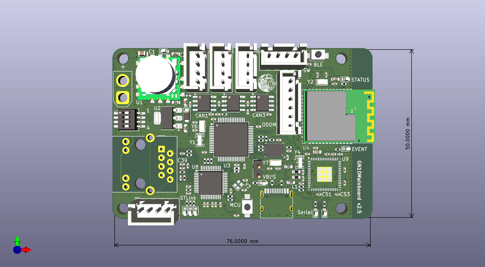

# GN10Mainboard

This is the main board for the NHK Robot Contest, combining an STM32 microcontroller and a Bluetooth-LE module called RNBD451PE.
It can connnect PC using Ethernet or CAN.

## Features

Power supply
- 7~14V input
- 5V-6A can be supplied from the CAN port
- Built-in power supply of 3.3V-1A

Interface
- Bluetooth Low Energy by RNBD451PE
- 3 CAN-communication port
- RJ45 Ethernet W5500
- UART communication port
- USB-type-C for STM32-UART and RNBD451PE debug
- 3 external switch
- 2 Incremental encoder

Other
- Mode can be switched by DIP switch-4P
- Gyro BNO086

Indicators
- 1 LED for 5V power
- 2 LED for USB Serial
- 3 LED (Red Green Blue) for MCU debug
- 2 LED for BLE module

## Main parts

- [STM32G474RCT6](https://www.stmcu.jp/stm32/stm32g4/stm32g4x4/66801/)
- [RNBD451PE](https://www.microchip.com/en-us/product/rnbd451pe)
- [FT2232HQ](https://ftdichip.com/products/ft2232hq/)
- [OKL-T/6-W12N-C](https://www.murata.com/ja-jp/products/productdetail?partno=OKL-T%2F6-W12N-C)
- [BNO086](https://www.mouser.jp/ProductDetail/CEVA/BNO086?qs=ulEaXIWI0c%2FqTo1scjodAw%3D%3D)

## Reference

https://github.com/ararobo/mainboradv2

## Development tools

- KiCad 9
- STM32CubeMX
